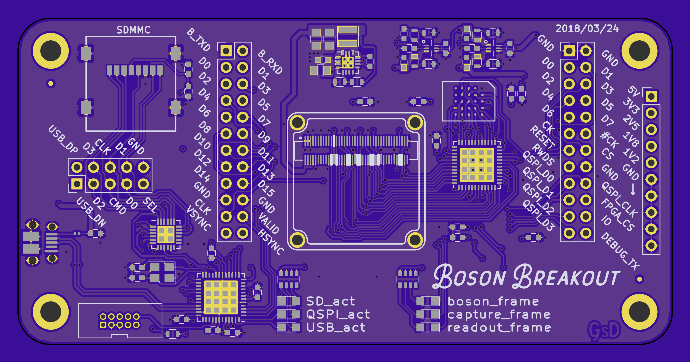

# kicadScripts
A collection of scripts to automate PCB rendering and exporting gerbers.

### Work inspired form the folling projects:
* [PcbDraw](https://github.com/yaqwsx/PcbDraw)
* [Scott Bezek's SplitFlap](https://github.com/scottbez1/splitflap)

*I found PcbDraw after I started writting my own tool to do the same function. (I couldn't get lxml to install on windows.)

# Usage #
## Create Pretty PNGs

`python plot_board.py <PathToYourAwesomeProject.kicad_pcb>`

## Create a GerberZip

`python plot_gerbers.py <PathToYourAwesomeProject.kicad_pcb>`

Files are placed within a `plot` directory in the folder of the .kicad_pcb file

# Features #

### plot_board.py

* Uses Kicad python bindings to render board layers as SVG
* Recolours SVGs
* Stacks SVGs with user defined colour/opacity
* Creates a drill layer
* Mirrors the backside of the PCB.
* Render to PNG with Inkscape CLI
* Supports multiple colours! (edit colour definition at top of file)

### plot_gerbers.py

* creates all the gerber/drill files.
* Renames with Protel Extensions `gtl,gts,gto,gml...`
* Puts all files into a single zip
* Renames Zip: `<Project><Date>_<Time>.zip` for easy tracking of versions.

# Examples #

# Improvements

- Generally Cleanup/Improve code
- Plot front and back Images next to each other on the same image.
- Correctly plot SolderMask ONLY over PCB. (currently masked by board outline bounding box.)
- Generate a bare board layer to better render areas without soldermask
- Add more commandline options. (colour choices, output DPI, )
